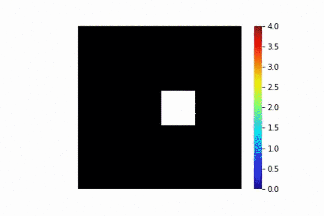
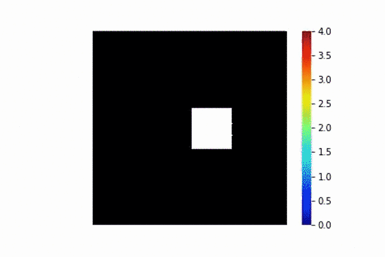

# MultiscaleRD
Code to accompany the paper ''Coupling particle-based reaction-diffusion 
simulations with reservoirs mediated by reaction-diffusion PDEs.'' 
by M. Kostré, C. Schütte, F. Noé and M. J. del Razo.

In this code we implemented a hybrid scheme that couples particle-based reaction-diffusion simulations with spatially and time dependent reservoirs mediated by reaction-diffusion PDEs. It solves the reaction-diffusion PDE with a finite difference sheme 
with a Crank-Nicolson integrator, and it implements particle based reaction-diffusion simulations based on the Doi model, similar as how it is done in [ReaDDy2](https://readdy.github.io/). The hybrid scheme consistently couples the particle-based simulationthe
to the PDE-mediated reservoir. We verify the scheme using two different examples: 
* A diffusion process with a proliferation reaction. This can be generalized for any systems with zeroth- and/or first-order reactions. (`multiscaleRD/FD_proliferation.py` and `multiscaleRD/Coupling_proliferation.py`)
* A Lotka-Volterra (predator-prey) reaction diffusion process. This can be generalized to any system with up to second-order reactions. (`mutliscaleRD/FD_LV.py` and `multiscaleRD/Coupling_LV.py`)

## Requirements

* python 3.x
* Numpy 1.12
* Scipy 0.19
* matplotlib 2.0 or above
* Multiprocessing 0.7
* git: to clone this repository 

## How to run this code?

* Clone this repository to your local machine: git clone https://github.com/MargKos/multiscaleRD.git
* Set the mathematical and numerical parameters for the finte difference scheme and the particle based simulation in `multiscaleRD/Parameters_(example).py`
* Solve the reaction-diffusion PDE of each example by running the finite difference code (`multiscaleRD/FD_(example).py`), this gives the reference solution(s)
* Run many particle-based simulations with `multiscaleRD/Coupling_(example).py`
* Run `multiscaleRD/Plot_(example).py` to calculate the mean-field of the particle-based simulations and to create the plots. 

## Folder Organization

* `multiscaleRD/Parameters_(example).py` contains mathematical (micro and macroscopic rates, diffusion coeeficient), numerical parameters (timestepsize, gridsize, boundarysize...)
and computational parameters (number of parallel simulations)
* In `multiscaleRD/FD_(example).py` we implemented the Finite Difference scheme for a RDE with homogeneous Neumann boundary conditions. 
* The `multiscaleRD/Coupling_(example).py` file runs many (here 30) parallel simulations. We recommend to adjust this file in such a way that the number
of parallel simulations corresponds to the number of cores of the computer. 
* `multiscaleRD/Injection.py` and `multiscaleRD/Reaction.py` content the functions used in `multiscaleRD/Coupling_(example).py`:
 Functions from `multiscaleRD/Injection.py` return lists of positions of new particles injected from the 
continuous domain. These lists are appended to the list of particles in `multiscaleRD/Coupling_(example).py`.
 In `multiscaleRD/Reaction.py` function for a  particle-based simulations (PBS) up to the second order are implemented,
 like proliferation (A->2A), dying (A->0) or the 
classical movement of particles calculated from the Euler-Muruyama scheme. The functions are used in `multiscaleRD/Coupling_(example).py` and 
return for example list of positions of newly created particles.
* `multiscaleRD/Plot_(example).py` calculates the mean-field creates hybrid plots, where the right part corresponds to the reference solution obtained 
through `multiscaleRD/FD_(example).py` and the left part to the average of the trajectories densities obtained from `multiscaleRD/Coupling_(example).py`.

## Sample solution

This example shows videos of the reference and hybrid solution for the preys in the Lotka-Volterra system (predator-prey).

 

## License

This project is licensed under the MIT License - see the [LICENSE](LICENSE) file for details
